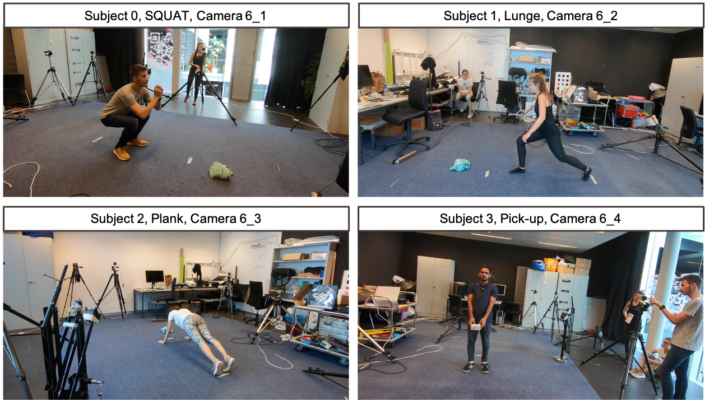
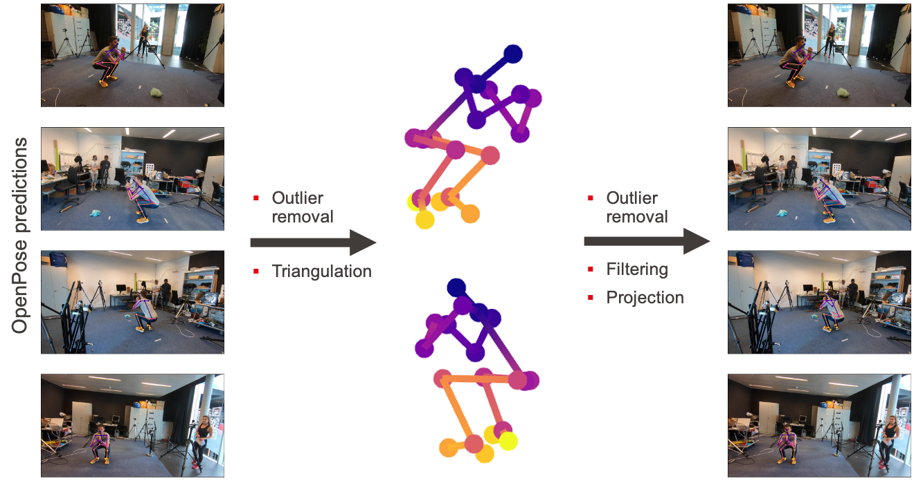

# 3D-Pose-Based-Feedback-For-Physical-Exercises

### Introduction
Unsupervised self-rehabilitation exercises and physical training can cause serious injuries if performed incorrectly. \ms{We introduce a learning-based framework that identifies the mistakes made by a user and proposes corrective measures for easier and safer individual training. Our framework does not rely on hard-coded, heuristic rules. Instead, it learns them from data, which facilitates its adaptation to specific user needs. To this end, we use a Graph Convolutional Network (GCN) architecture acting on the user's pose sequence to model the relationship between the the body joints trajectories. To evaluate our approach, we introduce a dataset with 3 different physical exercises. Our approach yields 90.9\% mistake identification accuracy and successfully corrects 94.2\% of the mistakes.


Figure1: Gif of Our results. The red poses correspond to the exercises performed incorrectly while the   green poses correspond to our corrections. 


### Framework

Figure2: **Our framework**  consists of a classification and a correction branch. They share several graph convolutional layers are then split such that the classification branch identifies the type of mistakes made by the user and the correction branch outputs a corrected pose sequence. The result of the classification branch is fed to the correction branch via a feedback module.

Our framework for providing exercise feedback relies on GCNs which can learn to exploit the relationships between the trajectories of individual joints. The overall model consists of two branches: **the classification branch** which predicts whether the input motion is correct or incorrect, specifying the mistake being made in the latter case, and **the correction branch** that outputs a corrected 3D pose sequence, providing a detailed feedback to the user. We feed the predicted action labels coming from the classification branch to the correction branch, which is called the “feedback module”. It allows us to explicitly provide label information to the correction module, enabling us to further improve the accuracy of the corrected motion.

### Datasets & Data preparation
Examples of acquired images for each action, subject and camera and 3D ground truth poses computation.

<p float="center">
  
  
</p>

You can access all the data used  [coming soon!](https://github.com/Jacoo-Zhao/3D-Pose-Based-Feedback-For-Physical-Exercises). 
Description of the data:

1. **data_3D.pickle** is the data source used in this paper. It contains the labels and 3D coordinates of all action sequences, while the coordinates have a size of (29789, 3, 25) where 29789 is the number of extracted frames for all action sequences, 3 is the x,y,z coordinates and 25 is the 25 skeletal nodes.

2. **data.pickle** basically contains all the raw  data, consisting of the camera parameters and the 2D and 3D coordinates of each skeleton node for each frame. However, due to the large size of the frames extracted from the video (182GB*4), it’s  hard to provide these image frames. If you would like to obtain images, please see items 3 and 4.

3. ** video.mp4** is the original four videos obtained by the four cameras, if you want to get the image frames, please refer  to  video_labelling.csv to intercept the video, we recommend using [ffmpeg](https://ffmpeg.org/) to extract the video frames one by one.

4. **video_labelling.csv** is used to provide labels to the original video, they contain manually labelled start and end frames belonging to the same subject and action label.

- If you wish to reproduce the results of this thesis, please use **data.pickle**.

- For processing and development relative to the raw data, please refer to **video.mp4** and **video_labelling.csv**.

### Dependencies
-   Cuda==10.1.168
-   numpy==1.21.5
-   pandas==1.3.5
-   python==3.7.12
-   tensorboard==2.8.0
-   torch==1.4.0
-   torch_dct==0.1.5
-   tqdm==4.63.1

### Getting Started
3D_Pose_Based_Feedback_for_Physical_Exercises has been implemented and tested on Ubuntu 18.04 with python >= 3.7. Our model is trained with GPU. If you don't have a suitable device, try running on [Google Colab](https://colab.research.google.com/notebooks/intro.ipynb).

Clone the repo:

    git clone https://github.com/Jacoo-Zhao/3D-Pose-Based-Feedback-For-Physical-Exercises.git
Install the requirements using `virtualenv` or `conda`:

    # pip 
    source scripts/install_pip.sh
    # conda 
    source scripts/install_conda.sh

 Training & Testing

*Coming soon!*

### Reference
This repository holds the code for the following paper:

[3D-Pose-Based-Feedback-For-Physical-Exercises](https://arxiv.org/abs/2208.03257). ACCV, 2022.

If you find our work useful, please cite it as:
```
@inproceedings{zhao2022exercise,
  author = {Zhao, Ziyi and Kiciroglu, Sena and Vinzant, Hugues and Cheng, Yuan and Katircioglu, Isinsu and Salzmann, Mathieu and Fua, Pascal},
  booktitle = {ACCV},
  title = {3D Pose Based Feedback for Physical Exercises},
  year = {2022}
}
```
### Acknowledgement

1.Some of our data process code for[ NTU RGB+D](https://github.com/shahroudy/NTURGB-D) was adapted/ported from [SGN](https://github.com/microsoft/SGN) by [Microsoft](https://github.com/microsoft). 

2.Our theoretical framework draws on the work in [Learning Trajectory Dependencies for Human Motion Prediction](https://arxiv.org/abs/1908.05436) by [Wei Mao](https://github.com/wei-mao-2019/LearnTrajDep). 
